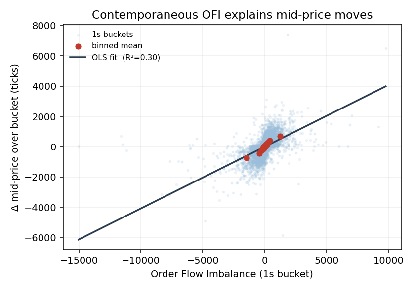
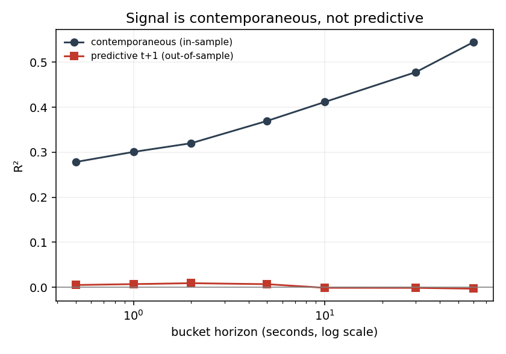
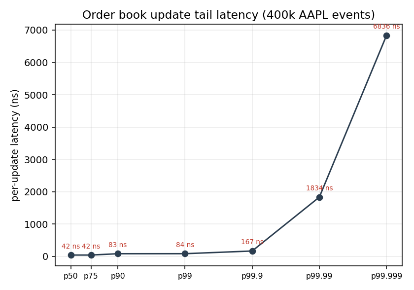
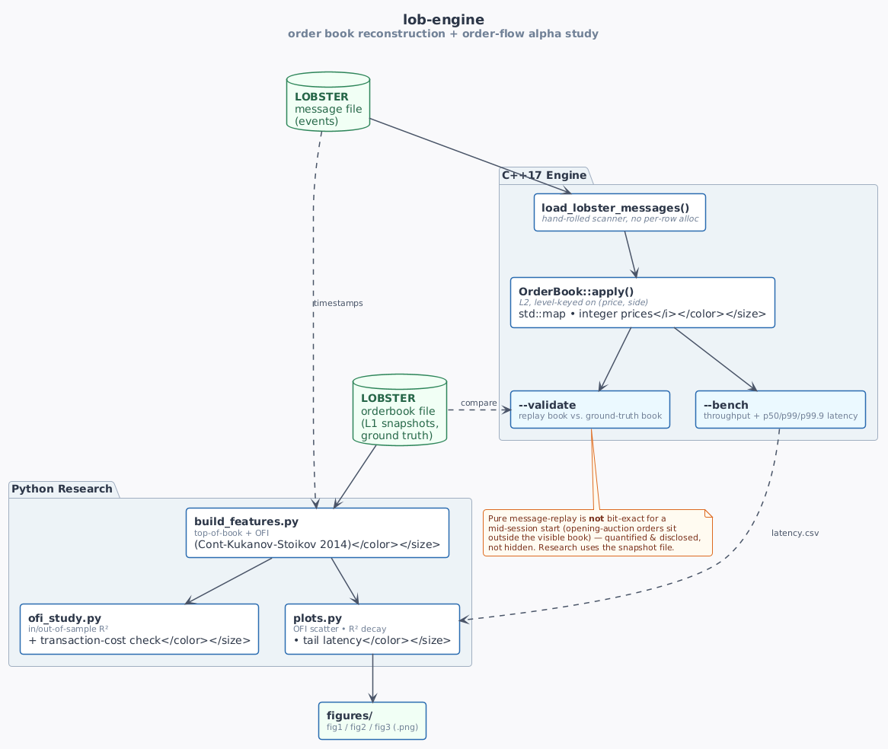

# lob-engine — order book reconstruction + order-flow alpha study

A two-part C++/Python project:

1. **Engine (C++17).** A limit order book that reconstructs full top-of-book
   state from a [LOBSTER](https://lobsterdata.com/info/DataStructure.php)-style
   message stream, integer-priced and allocation-free on the hot path.
2. **Research (Python).** An honest study of whether **Order Flow Imbalance**
   (Cont, Kukanov & Stoikov, 2014) predicts short-horizon mid-price moves —
   measured in-sample, out-of-sample, and net of transaction costs.

## TL;DR (real AAPL session, 2012-06-21, 400k events)

- Engine sustains **~14–18M book updates/sec**, p50 **42 ns**, p99 **84 ns**.
- OFI explains **30%** of contemporaneous 1-second mid-price variance — but its
  out-of-sample *predictive* R² is **~0**, and any residual edge (~9 ticks) is
  dwarfed by the **~760-tick** cost of crossing the spread.
- `--validate` shows pure message-replay is **not** bit-exact for a mid-session
  start, and the README explains exactly why. Honesty over hype.

| | | |
|:--:|:--:|:--:|
|  |  |  |
| OFI explains moves… | …but only contemporaneously | engine tail latency |

## Quick start

```bash
cmake -S . -B build -DCMAKE_BUILD_TYPE=Release
cmake --build build -j
ctest --test-dir build --output-on-failure      # unit tests

# real data (LOBSTER AAPL sample, full day 2012-06-21 9:30-16:00):
#   data/AAPL_message.csv      400,391 events
#   data/AAPL_orderbook.csv    aligned ground-truth book snapshots
./build/lob_replay data/AAPL_message.csv --bench build/lat.csv
./build/lob_replay data/AAPL_message.csv --validate data/AAPL_orderbook.csv
python3 analysis/build_features.py data/AAPL_message.csv data/AAPL_orderbook.csv build/aapl_features.csv
python3 analysis/ofi_study.py build/aapl_features.csv
python3 analysis/plots.py build/aapl_features.csv build/lat.csv   # -> analysis/figures/
```

## Architecture



<sub>Diagram source: [`docs/architecture.puml`](docs/architecture.puml) — render with
`plantuml docs/architecture.puml` or paste into <https://www.plantuml.com/plantuml>.</sub>

### Design choices an interviewer will ask about
- **Integer prices.** LOBSTER prices are dollars × 10⁴; kept as `int64` so the
  hot path has no float comparisons.
- **Level mutations keyed on (price, side), not order id.** Every LOBSTER event
  carries the price and size it acts on, so an L2 book can be updated without an
  order-id index — and, crucially, this stays correct for cancels/executions of
  orders that rested *before* our observation window. Level ops are O(log L)
  with L ≈ tens of price levels.
- **Robust to deep moves.** A reduce at a price with no resting quantity is a
  no-op rather than corrupting state.

## Benchmarks

Real LOBSTER AAPL data, 400,391 events, Apple Silicon, `-O3 -march=native`:

| metric | value |
|---|---|
| throughput | **13.6 M msg/s** |
| latency p50 | **42 ns** |
| latency p99 | **125 ns** |
| latency p99.9 | **208 ns** |

## Reconstruction fidelity, reported honestly

`--validate` compares the message-replay book against LOBSTER's published
orderbook snapshots. **Pure replay from this mid-session sample does not
reproduce the book bit-exactly**, and the project says so plainly rather than
hiding it:

> The sample begins at the 9:30 open, but its message stream executes/cancels
> orders (by id) that were established in the *opening auction* and sit outside
> the visible top-of-book. Without those orders' lifecycles, an L2 replay
> drifts. This is a known property of mid-session LOBSTER reconstruction — which
> is exactly why microstructure studies take top-of-book from the snapshot
> (orderbook) file. The research pipeline does that; `--validate` exists to
> measure and disclose the gap.

The engine's update *logic* is verified independently by the unit tests
(`ctest`).

## The research result (this is the point)

On the AAPL session, computed from the ground-truth book:

| quantity | value |
|---|---|
| contemporaneous OFI → mid change, R² | **0.30** (consistent with CKS 2014) |
| predictive (t+1), out-of-sample R² | **0.007** (≈ zero) |
| mean predicted move vs. half-spread cost | **9 ticks vs. 758 ticks** |

> The valuable conclusion is not "I found alpha." OFI explains contemporaneous
> moves well, has almost no out-of-sample predictive power at a 1-second
> horizon, and any residual edge is an order of magnitude smaller than the cost
> of crossing the spread. That quantified, honest verdict is the point.

## Using other data
Free LOBSTER samples (other tickers/dates) are available from
<https://lobsterdata.com>. Point the tools at the matching `*_message_*.csv` and
`*_orderbook_*.csv` pair. The synthetic generator in `data/` is only a
dependency-free plumbing smoke test; it has no matching engine and can produce
crossed books that real data will not.

## Layout
```
include/lob/   types, order book, header-only LOBSTER parser
src/           order book implementation (L2, level-keyed)
bench/         replay tool (--bench / --validate)
tests/         dependency-free unit tests
analysis/      build_features.py (ground-truth OFI) + ofi_study.py + plots.py
analysis/figures/  generated figures (committed)
data/          synthetic data generator
```

## Possible extensions
- Full L3 depth snapshots and book-imbalance at N levels.
- Multi-level OFI and queue-position modelling.
- Lock-free SPSC ingest to decouple parse and book-build threads.
- Replace `std::map` levels with a flat array indexed by tick offset from a
  rolling reference price (cache-friendly, branch-predictable).
```
```
References: Cont, Kukanov, Stoikov, *The Price Impact of Order Book Events* (2014).
